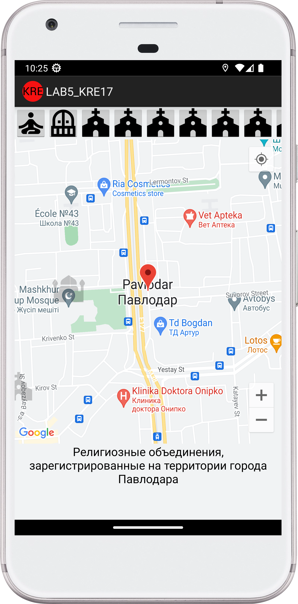
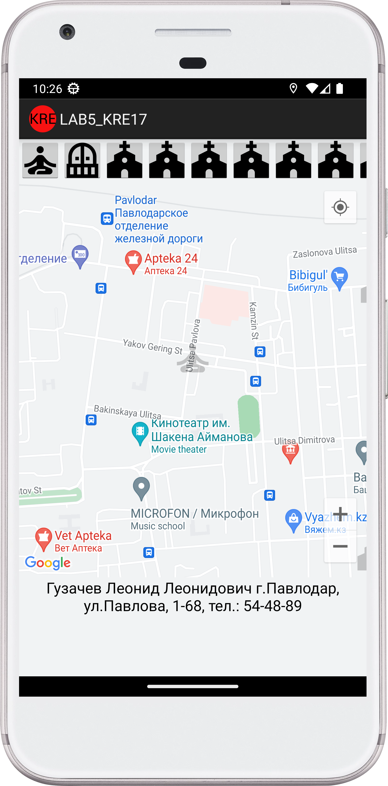
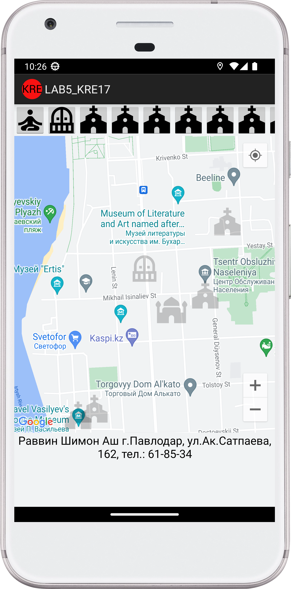
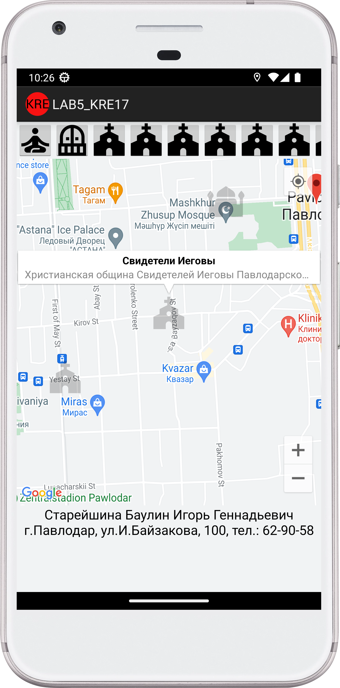
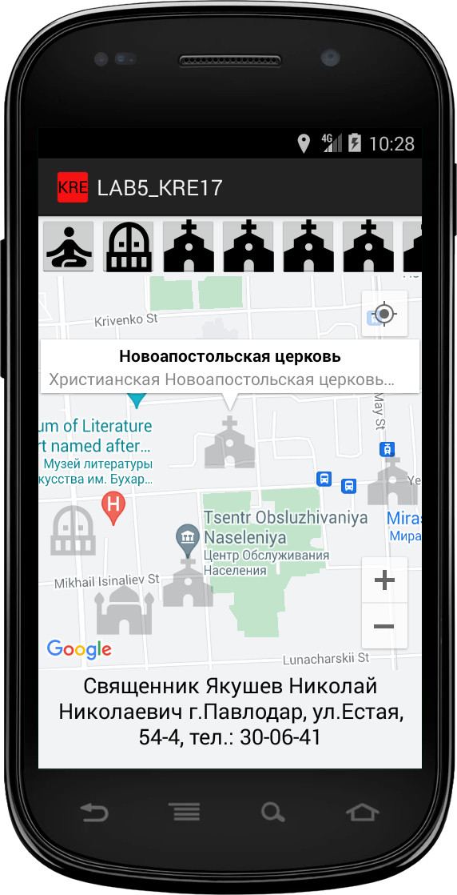
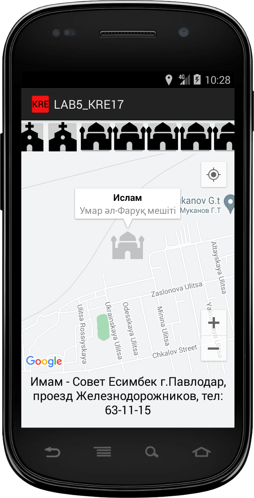
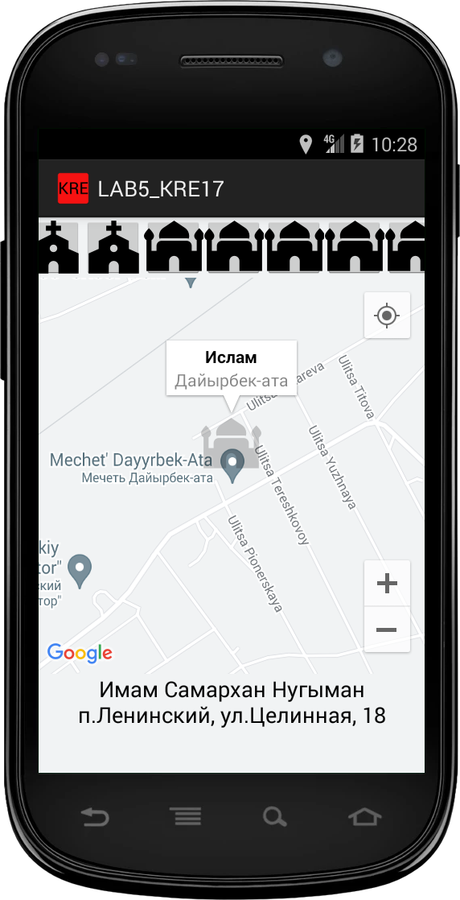
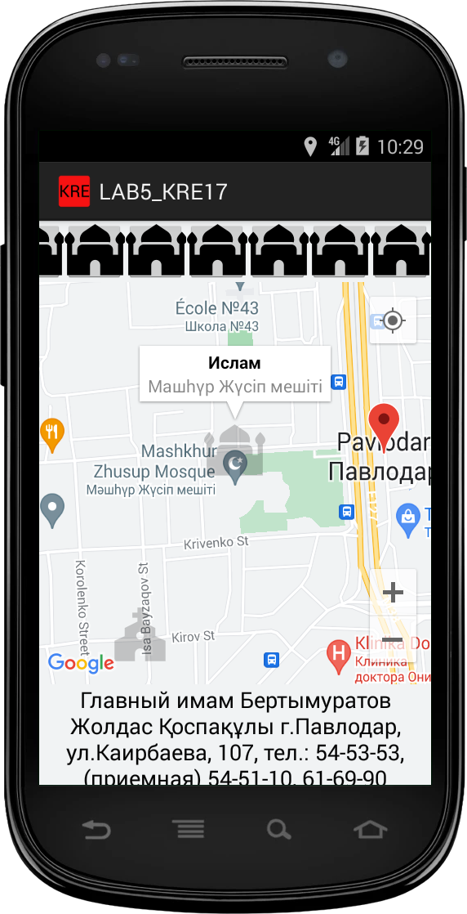

<a href="https://kairulla.github.io/LAB5_KRE17/">ссылка на источник данных</a> <a href="https://www.gov.kz/memleket/entities/pavlodar-pvl/press/article/details/14991?lang=ru&ysclid=latvt1ilgb661759668">ссылка на основной источник данных</a>

